  
  

  

   
  
  
  
  
  

  Ingeniero en Informática que construye productos full-stack con IA en cada capa: como herramienta de desarrollo,
  como funcionalidad dentro de las apps que entrego y como pipeline generativo local.

<h2 align="center">🤖 Construyo con IA</h2>

<table>
  <tr>
    <td width="25%" valign="top" align="center">
      <b>Ingeniería asistida por IA</b>  
      Agentes de código con límites que hacen cumplir las herramientas y reglas escritas. Detalles más abajo.  
          
    </td>
    <td width="25%" valign="top" align="center">
      <b>Productos con LLMs</b>  
      De fotos a registros estructurados, asistentes dentro de la app con la API key del propio usuario (BYOK), recuperación de información y agentes.  
         
    </td>
    <td width="25%" valign="top" align="center">
      <b>IA generativa local</b>  
      Pipelines de imágenes en mi propia GPU, ajustados a un presupuesto de 16 GB de VRAM, con personajes consistentes.  
         
    </td>
    <td width="25%" valign="top" align="center">
      <b>ML y visión por computadora</b>  
      Clasificación y reconocimiento en tiempo real. Tesis sobre control de semáforos con IA: hasta un 58% menos de tiempo de espera en simulaciones.  
       
    </td>
  </tr>
</table>

<h2 align="center">Cómo trabajo con agentes de código</h2>

  Programo con Claude Code y Antigravity. Lo que mantiene eso bajo control, separado entre
  lo que hacen cumplir las herramientas y lo que es una regla escrita.

<table width="100%">
  <tr>
    <td width="50%" valign="top">
      <b>Lo hacen cumplir las herramientas</b>
      <ul>
        <li><code>main</code> está protegida en casi todos mis repos de apps: los cambios entran solo por pull request.</li>
        <li>Cada repo tiene una lista de comandos permitidos para el agente. Lo que queda afuera necesita mi aprobación.</li>
        <li>Hooks de Claude Code revisan las migraciones de base de datos mientras el agente las escribe.</li>
        <li>El pre-commit corre escaneo de secretos (gitleaks), lint y chequeo de tipos en cada commit.</li>
      </ul>
    </td>
    <td width="50%" valign="top">
      <b>Reglas escritas que sigue el agente</b> (<code>AGENTS.md</code>)
      <ul>
        <li>Los agentes commitean y nunca pushean. El merge a <code>main</code> lo hago yo.</li>
        <li>Plan primero para todo lo que toca la base de datos, los permisos o varios archivos.</li>
        <li>Una tarea está lista solo si se corrieron build, lint y tests, y si algo falla se informa la salida real.</li>
        <li>Si falta información, el agente pregunta en lugar de inventarla.</li>
      </ul>
    </td>
  </tr>
</table>

<h2 align="center">⚡ Tecnologías</h2>

  

<table width="100%">
  <tr>
    <td width="170"><b>Lenguajes</b></td>
    <td align="center"> Python · TypeScript · Dart · SQL (PostgreSQL)</td>
  </tr>
  <tr>
    <td width="170"><b>Frontend y mobile</b></td>
    <td align="center"> React · Flutter · Tailwind CSS · Vite</td>
  </tr>
  <tr>
    <td width="170"><b>Backend y datos</b></td>
    <td align="center">  FastAPI · Supabase · Shopify (Storefront)</td>
  </tr>
  <tr>
    <td width="170"><b>Cloud y DevOps</b></td>
    <td align="center"> Docker · Git · Azure · Netlify</td>
  </tr>
  <tr>
    <td width="170"><b>Herramientas y flujo</b></td>
    <td align="center"> Bash · VS Code · Scrum · Git Flow</td>
  </tr>
</table>

   
  Proyectos académicos y anteriores. Me defiendo, pero estoy oxidado.

<table width="100%">
  <tr>
    <td width="170"><b>Ecosistema Java</b></td>
    <td align="center">  Java · Spring Boot · JHipster</td>
  </tr>
  <tr>
    <td width="170"><b>Web</b></td>
    <td align="center"> Angular · Bootstrap</td>
  </tr>
  <tr>
    <td width="170"><b>Datos y Python</b></td>
    <td align="center"> Flask · MongoDB · MySQL · Elasticsearch</td>
  </tr>
  <tr>
    <td width="170"><b>Testing y CI</b></td>
    <td align="center"> Cypress · Selenium · Jenkins</td>
  </tr>
  <tr>
    <td width="170"><b>ML e infraestructura</b></td>
    <td align="center"> PyTorch · Kubernetes</td>
  </tr>
</table>

<h2 align="center">🎓 Aprendiendo ahora</h2>

   

<h2 align="center">💻 Hardware</h2>

  
  
  
   
  Fuera del código: domótica, electrónica, hardware, videojuegos y economía · Español (nativo), Inglés (B2)

  
  

